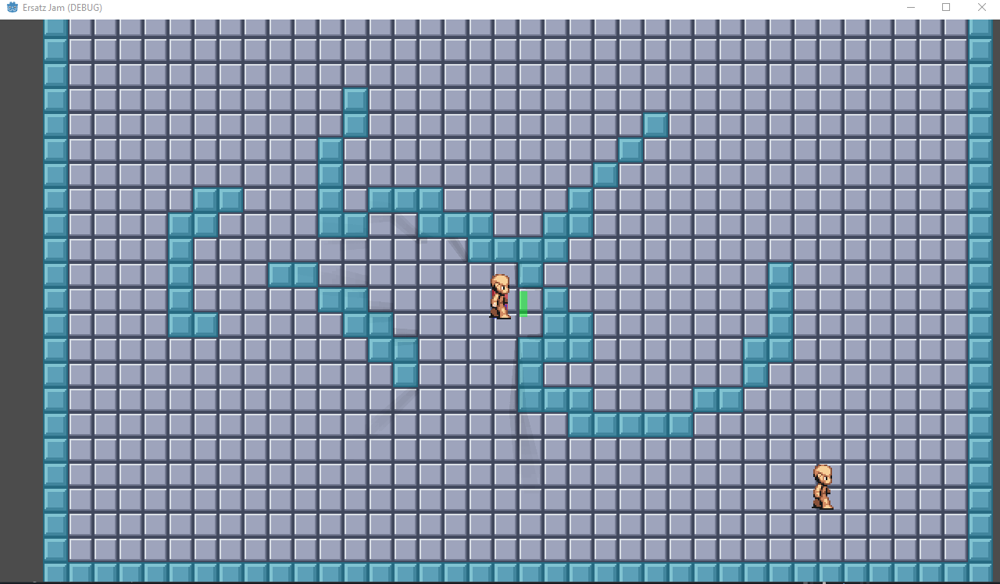

# ErsatzJam

ErsatzJam is ... not exactly a jam game. Basically I paired up with a narrative friend for a bit of accountability as we did some exploration in a way that would flex creative muscles that would be used on a larger upcoming project. The scope was intentionally too large for the team and, at least for me, I pushed it into bits of the platform that I was unfamiliar with.

## Results

Solid [idea](./readme/pitch.md) in my opinion. Jamming with Kyle (narrative half of the team) was great. Going to keep this idea in my back pocket for a future [Improve My Game Jam](https://itch.io/jam/imgj33) attempt when I can staff an actual team for it. Technically I got a bunch of the experience with Godot that I wanted but as a game : huge flop. Systems were in place enough to start wiring but lack of art/level design support was a huge issue and drain motivationally

My long standing metric for jam success is "game has enough meat to want to rebuild" so VOC would be a mitigated failure in that regard. The bones are good but I didn't get enough meat on them to really prove the idea. Still want to rebuild it though so :shrug:

Some systems working:


I got a day & night cycle & simple lighting working ([video](./readme/dn_cycle.mp4), 20s period)

Fixed that waypoint scaling bug; bonus appearance of the agent getting stuck at the end.


## Lesson Summary

Here's some of the major things I learned vs my last dance with Godot.

**Tilemaps**  
First party tilemap support is "not great" (afaict, ymmv). IMO it will be extremely worthwhile to explore some of the Tiled integration addons. [YATI](https://godotengine.org/asset-library/asset/1772) seems promising.

I did not love lighting on a per-tile model as it caused self-shadowing and did allow for multiple occluder poly settings: open/closed setting or cull mode. A [related complaint](https://forum.godotengine.org/t/disabling-self-shading-on-tilemaps-in-godot-4/36987/4) That work around _probably_ solves the problem but it's a pain in the ass. I _think_ I also witnessed discontinuous shadow casting as well but don't have hard evidence off hand.

Lighting on tiles seems to be more angular than ideal though this could very well be a me problem. I'm not 100% certain that tilemaps are the right path forward vs hand-painted backgrounds laid down in large chunks as sprites and with custom load/unloading logic to manage performance.

**On NPC behavior / composition**  
My intuition on how to compose NPC behavior with a shitty/hand-rolled model was a poor showing. While it would have (mostly) worked I think it'd have led to a bunch of duplication in a real environment. Further isolation is necessary. Additionally more time & effort should be given to identify logic that can be shared between player and NPC (alternatively refactor aggressively & often), e.g., a lot of movement -> direction -> animation code started in player then got cargo culted into NPC.

Extremely worthwhile looking into Behavior Trees libraries.

**Navigation 1**  
Navigation seems mostly straight forward; mostly is doing some heavy lifting though.

When dealing with navigation I had roughly the following setup

```
Scene
  - NavigationRegion2D
  - NPC (CharacterBody2D -- basic controls / collision / sensors / lighting)
    - Guard (Node2D -- behavioral controls / custom sensors)
      - NavAgent (NavAgent2D -- Guard scene internal child)
      - Patrol Path (Polygon2D -- Guard scene external)
```

The nav region, nav agent, patrol path all had scale 1. The NPC had scale 2 because I was displaying it as a 64x64 sprite but it was a 32x32 asset.

When `Guard._Ready` ran it would pull the points from the patrol poly into itself to learn what patrol path it should follow. My thought was that this would allow an easy way to visually represent guard behavior in the editor relative to the level. To do that it was a simple `GetParent().Position + Position + Poly.Position + Point`. This was necessary because the `NavigationRegion2D` was in a different coordinate system than the points we could derive naturally from the poly. However because scale multiples you also need to factor that in at each step:

```
var newPos = npc.Position +
  (Position * npc.Scale) +
  (poly.Position * npc.Scale * Scale) +
  (PatrolPath[i] * npc.Scale * Scale * poly.Scale);
```

I forgot to let the accumulated scale flow down initially and the navigation bugs were wild. Also debugging it was tricky because I forgot that the debug drawing from `Guard` were all scaled by 2x.

Anyway, this isn't any fundamental lesson so much as "don't make this mistake again."

**Navigation 2**  
Once I got the above bug sorted I noticed that from time to time the nav agent got stuck on nothing and left the guided agent bouncing / vibrating between two points. I was able to unstick them consistently buy nudging with another rigid body. Any timing-based guard puzzles must have a solution or understanding of this. I haven't done any digging here but I can't imagine it's a unique issue.

**Navigation Honorable Mention**  
I can't find documentation of this but I think it may be true and I'm pretty sure I got it from one of the threads/guides I was reading...

`NavigationRegion2D` will only bake the Layer0 into a navmesh which is (technical term) "some fucking bullshit."

**On handling sprite animations**  
Godot leans super hard into in-editor definitions for everything but stuff like animation. We will almost certainly need to work on pipeline tooling for this. I never want to spend another minute of my life cutting sprite sheets into animation frames manually.

We'll need to coordinate with the art team to agree upon some format or find some common export format that existing addons support. There are some addons that promise to add

Additionally if we want to coordinate callbacks into our animations that doesn't come for free for `AnimatedSprite2D` and we'll need to extend it / override `OnFrameChanged` and watch for the frame triggers we've defined.